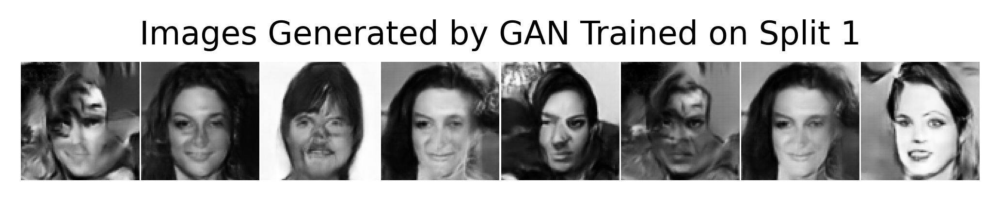
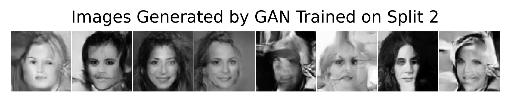
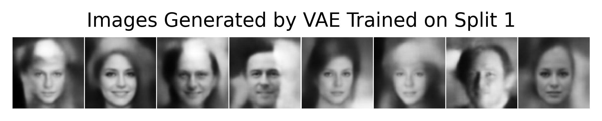
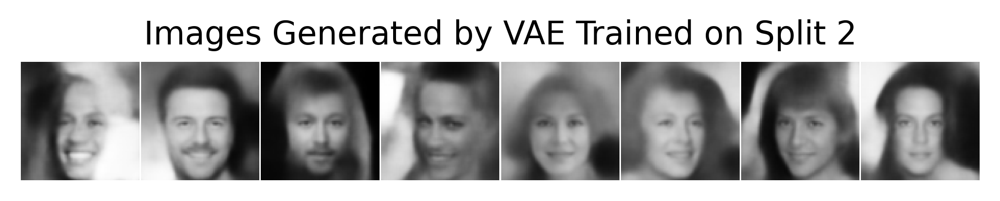

# Generative Model Generalization: Split-Data GAN/VAE Course Project

This is an ECE 695 course project, not a research paper. It explores a question
motivated by a diffusion-model result presented by Kadkhodaie et al. at ICLR
2024: if two models with the same architecture are trained independently on
disjoint halves of a dataset, do they learn similar mappings from latent noise
to images?

The project asks whether related behavior can be observed with GANs and VAEs.
The notebook loads two models per architecture, supplies the same fixed latent
inputs to both models, compares their generated outputs, and includes latent
interpolations and nearest-training-image comparisons. It uses CelebA and
MNIST. For CelebA, the split scripts use two disjoint 100,000-image
subsets and leave 2,599 images unused. For MNIST, they use disjoint subsets of
30,000 images each.

These are qualitative, exploratory experiments. Similar-looking samples or
high pixel-space cosine similarity do not by themselves establish
generalization or rule out memorization. Treat the figures as course-project
observations, not as a controlled replication or a publication-level result.

## Example outputs

CelebA samples from GANs trained on the two separate splits, generated from
shared latent inputs:

| GAN, split 1 | GAN, split 2 |
| --- | --- |
|  |  |

Corresponding VAE samples:

| VAE, split 1 | VAE, split 2 |
| --- | --- |
|  |  |

The images are saved outputs from the project notebook. They are illustrative
examples, not a quantitative summary.

## Repository contents

- `testbench.ipynb`: loads model checkpoints, generates shared-latent samples,
  visualizes interpolations, and compares generated images with training
  examples. The notebook includes saved cell outputs.
- `gan_s1_CelebA.py`, `gan_s2_CelebA.py`: GAN training scripts for the two
  CelebA splits.
- `vae_s1.py`, `vae_s2.py`: VAE training scripts for the two CelebA splits.
- `gan_s1_MNIST.py`, `gan_s2_MNIST.py`: GAN training scripts for MNIST.
- `assets/`: representative CelebA generated-sample grids for this README.

## Exploring the notebook

Install PyTorch and a matching Torchvision build for your platform, then the
additional Python packages used by the notebook:

```bash
python -m pip install numpy matplotlib pillow scikit-image tqdm pytorch-fid jupyter
```

Download the trained checkpoints into a `models/` directory beside
`testbench.ipynb` from the [project checkpoint folder](https://drive.google.com/drive/folders/1datMe52uMlDHtTKbOooFJP5esqUNZD5f?usp=share_link).
Then open the notebook:

```bash
jupyter lab testbench.ipynb
```

The notebook also needs the CelebA and MNIST datasets. Torchvision attempts to
download them automatically. If the CelebA mirror fails, the dataset files
listed in the notebook can be obtained from the
[CelebA dataset folder](https://drive.google.com/drive/folders/0B7EVK8r0v71pWEZsZE9oNnFzTm8?resourcekey=0-5BR16BdXnb8hVj6CNHKzLg).

## Training from scratch

The standalone training scripts are historical, monolithic experiment
scripts. Running one starts training immediately, with long runs configured
for 200 epochs. They assume datasets are available and save checkpoints under
`models/`. Create that directory first. Training the CelebA models is
compute-intensive, and the scripts may need device settings adjusted for your
hardware. The notebook is the easier way to inspect the saved results.
